# governed-llm-gateway

A small internal **LLM gateway**: one governed entry point for every model call in an
organisation. Applications call the gateway instead of calling models directly, and the gateway:

- **routes** each request to the cheapest model that is good enough: a local open-weight model,
  a fast commercial model or a strong one;
- **protects data**: personal data is masked before it leaves, or the request stays on a local
  model, according to each team's policy;
- **controls cost**: per-team monthly budgets, blocking or degrading to a cheaper model, response
  caching, and chargeback reports by team and model;
- **explains itself**: every answer says which model answered, why, and what it cost;
- **speaks the OpenAI format**, so existing SDKs and tools work by changing a base URL and a key.

> Independent project. Model names and prices in the example configuration are placeholders to
> adjust; the local model runs through [Ollama](https://ollama.com) or any OpenAI-compatible
> server.

## Why a gateway

When every team calls model APIs directly, an organisation cannot answer basic questions: who
spends what, on which model, with what data? It also cannot enforce a rule such as "personal
data never goes to an external provider" in one place. A gateway turns those rules into code
that every call passes through, and makes model choice a measured decision rather than a habit.

## How a request flows

```mermaid
flowchart LR
    A["App or SDK<br/>(OpenAI format)"] --> K["Authenticate<br/>team key (hashed)"]
    K --> P["Detect personal data<br/>email, phone, IBAN, card"]
    P --> R["Route<br/>data policy → requested tier →<br/>auto complexity → allowed models"]
    R --> B{"Budget<br/>check"}
    B -- "over budget" --> X["Block (402) or<br/>degrade to cheaper model"]
    B -- "ok" --> M["Mask personal data<br/>(external models only)"]
    X --> M
    M --> C{"Cache<br/>(temperature 0)"}
    C -- "hit" --> O
    C -- "miss" --> L["Call model<br/>fall back on failure"]
    L --> U["Restore masked values"]
    U --> O["Answer + route reason,<br/>cost, cache, masking"]
    O --> G[("Ledger: tokens, cost,<br/>latency, status.<br/>Never the content")]
```



Team data policies:

| Policy | Behaviour |
|---|---|
| `local_only` | Nothing leaves the organisation: only local models |
| `mask_pii` | External models allowed; personal data is replaced by placeholders such as `[EMAIL_1]` before sending and restored in the answer |
| `local_if_pii` | External models allowed, but any request containing personal data stays local |

## Quick start

Requires Python 3.10+. For the local model, install [Ollama](https://ollama.com) and run
`ollama pull llama3.1:8b`, or a smaller model such as `llama3.2:3b` on a modest laptop, and set
it in the config.

```bash
python -m venv .venv
# Windows (PowerShell): .venv\Scripts\Activate.ps1      macOS/Linux: source .venv/bin/activate
pip install -e ".[dev]"
pytest                                            # 61 offline tests

llmgw init --config gateway.json                  # example config: 3 models, 3 teams
llmgw keys add research --config gateway.json     # prints a key once; only its hash is stored
export ANTHROPIC_API_KEY=sk-ant-...               # PowerShell: $env:ANTHROPIC_API_KEY="sk-ant-..."
llmgw serve --config gateway.json                 # http://127.0.0.1:8080
```

Call it with any OpenAI-compatible client:

```python
from openai import OpenAI

client = OpenAI(base_url="http://127.0.0.1:8080/v1", api_key="gw_research_...")
reply = client.chat.completions.with_raw_response.create(
    model="auto",  # or "fast", "strong", "local", or a model alias
    messages=[{"role": "user", "content": "Summarise the attached note for jane@example.org"}],
)
print(reply.parse().choices[0].message.content)
print(reply.headers["x-gateway-model"], reply.headers["x-gateway-cost-usd"])
```

Useful commands:

```bash
llmgw ask "What is 15% of 200?" --team research --config gateway.json   # one-off, no server
llmgw report --config gateway.json --month 2026-10 --csv chargeback.csv
```

The report shows requests, tokens, cost, cache hits, masked values and refusals by team and
model, against each team's budget: the basis for internal chargeback.

Without an Anthropic key, calls to Claude fail cleanly and the gateway falls back to the local
model. Every answer says so in its route reason.

## Evaluation: is "auto" worth it?

`evals/tasks.jsonl` holds 24 tasks, 12 simple and 12 complex (multi-step arithmetic, structured
extraction, rules, constraints). Each has a difficulty label assigned by a person and a
**deterministic answer check**, so no model grades another model and scores are reproducible.
The evaluation runs every task through four strategies (always strong, always fast, always
local, and `auto`) and reports pass rate, cost, latency and the models used:

```bash
llmgw eval evals/tasks.jsonl --config gateway.json --recordings evals/recordings --out evals/results
```

The first run records every model answer (including failures). After that, the same evaluation
replays offline, identically and for free, and CI runs it on every push.

**Router agreement with human labels** needs no model calls, so it is measured already: **22 of
24** (all 12 simple tasks routed to the fast tier; 10 of 12 complex tasks to the strong tier).
The two misses are a formatting-constraint task and a code-reading task. Whether they matter
depends on whether the fast model passes them anyway, which is what the live run shows.

## Security and governance notes

- API keys are generated by the CLI, shown once, and stored only as SHA-256 hashes; comparison
  is constant-time.
- The ledger stores tokens, cost, latency, route reason and status, **never prompt or answer
  text**. It can be shared with finance.
- Personal-data detection covers emails, phone numbers, IBANs (checksum-validated) and card
  numbers (Luhn-validated). **Names and addresses are not detected**: teams handling them
  should use `local_only` or `local_if_pii`, or add a named-entity model (roadmap).
- The cache is scoped per team, stores masked text, and is used only at temperature 0.
- Budget checks use a pre-call estimate (about 4 characters per token for input, plus the
  maximum output). Actual cost is recorded after the call.
- The server binds to 127.0.0.1 by default. For shared use, put it behind the organisation's
  reverse proxy with TLS.

## Limitations and roadmap

- [ ] Streaming responses
- [ ] A learned router (a small classifier trained on logged routes and outcomes) compared with
      the rule-based one on the same task set
- [ ] Named-entity detection for personal data (names, addresses) with a local model
- [ ] Per-team rate limits, and alerts at 80% of budget
- [ ] OpenTelemetry traces and a usage dashboard
- [ ] Single sign-on (OIDC) instead of static team keys

## Project layout

```
src/llmgw/
  gateway.py     the pipeline: auth, policy, budget, masking, cache, fallback, ledger
  router.py      explainable routing rules and the complexity estimate
  pii.py         reversible masking of personal data
  providers.py   Anthropic, OpenAI-compatible (Ollama, vLLM...), record/replay
  ledger.py      SQLite usage ledger, chargeback query, response cache
  api.py         FastAPI app: OpenAI-compatible endpoints
  evaluation.py  deterministic answer checks and strategy comparison
  config.py      teams, models, policies; example configuration
  cli.py         init | keys add | serve | ask | report | eval
tests/           offline tests: fake providers, a local stand-in for the Claude API
evals/           the task set (and, after a live run, recordings and results)
docs/            design decisions
```

## License

MIT. See [LICENSE](LICENSE).
