# governed-llm-gateway

[](https://github.com/flam7791/governed-llm-gateway/actions/workflows/ci.yml) [](LICENSE) 

A small internal **LLM gateway**: one governed entry point for every model call in an
organisation. Applications call the gateway instead of calling models directly, and the gateway:

- **routes** each request to the cheapest model that is good enough: a local open-weight model,
  a fast commercial model or a strong one (Claude, Azure OpenAI, or both);
- **protects data**: personal data is masked before it leaves, or the request stays on a local
  model, according to each team's policy;
- **controls cost**: per-team monthly budgets, blocking or degrading to a cheaper model, response
  caching, and chargeback reports by team and model;
- **explains itself**: every answer says which model answered, why, and what it cost;
- **speaks the OpenAI format** (chat and embeddings), so existing SDKs and tools work by changing
  a base URL and a key;
- **can be operated**: Prometheus metrics, one JSON log line per request, a health check, and a
  container image; secrets come from the environment, never from files.

> Independent project. Model names and prices in the example configuration are placeholders to
> adjust; the local model runs through [Ollama](https://ollama.com) or any OpenAI-compatible
> server.

## Why a gateway

When every team calls model APIs directly, an organisation cannot answer basic questions: who
spends what, on which model, with what data? It also cannot enforce a rule such as "personal
data never goes to an external provider" in one place. A gateway turns those rules into code
that every call passes through, and makes model choice a measured decision rather than a habit.

## How a request flows

```mermaid
flowchart LR
    A["App or SDK<br/>(OpenAI format)"] --> K["Authenticate<br/>team key (hashed)"]
    K --> P["Detect personal data<br/>email, phone, IBAN, card"]
    P --> R["Route<br/>data policy → requested tier →<br/>auto complexity → allowed models"]
    R --> B{"Budget<br/>check"}
    B -- "over budget" --> X["Block (402) or<br/>degrade to cheaper model"]
    B -- "ok" --> M["Mask personal data<br/>(external models only)"]
    X --> M
    M --> C{"Cache<br/>(temperature 0)"}
    C -- "hit" --> O
    C -- "miss" --> L["Call model<br/>fall back on failure"]
    L --> U["Restore masked values"]
    U --> O["Answer + route reason,<br/>cost, cache, masking"]
    O --> G[("Ledger: tokens, cost,<br/>latency, status.<br/>Never the content")]
```



Team data policies:

| Policy | Behaviour |
|---|---|
| `local_only` | Nothing leaves the organisation: only local models |
| `mask_pii` | External models allowed; personal data is replaced by placeholders such as `[EMAIL_1]` before sending and restored in the answer |
| `local_if_pii` | External models allowed, but any request containing personal data stays local |

## Quick start

Requires Python 3.10+. For the local model, install [Ollama](https://ollama.com) and run
`ollama pull llama3.1:8b`, or a smaller model such as `llama3.2:3b` on a modest laptop, and set
it in the config.

```bash
python -m venv .venv
# Windows (PowerShell): .venv\Scripts\Activate.ps1      macOS/Linux: source .venv/bin/activate
pip install -e ".[dev]"
pytest                                            # 79 offline tests

llmgw init --config gateway.json                  # example config: 4 models, 3 teams
llmgw keys add research --config gateway.json     # prints a key once; only its hash is stored
export ANTHROPIC_API_KEY=sk-ant-...               # PowerShell: $env:ANTHROPIC_API_KEY="sk-ant-..."
llmgw serve --config gateway.json                 # http://127.0.0.1:8080
```

Call it with any OpenAI-compatible client:

```python
from openai import OpenAI

client = OpenAI(base_url="http://127.0.0.1:8080/v1", api_key="gw_research_...")
reply = client.chat.completions.with_raw_response.create(
    model="auto",  # or "fast", "strong", "local", or a model alias
    messages=[{"role": "user", "content": "Summarise the attached note for jane@example.org"}],
)
print(reply.parse().choices[0].message.content)
print(reply.headers["x-gateway-model"], reply.headers["x-gateway-cost-usd"])
```

Useful commands:

```bash
llmgw ask "What is 15% of 200?" --team research --config gateway.json   # one-off, no server
llmgw report --config gateway.json --month 2026-10 --csv chargeback.csv
```

The report shows requests, tokens, cost, cache hits, masked values and refusals by team and
model, against each team's budget: the basis for internal chargeback.

Without an Anthropic key, calls to Claude fail cleanly and the gateway falls back to the next
allowed model. Every answer says so in its route reason. A request for a local model never falls
back to an external one.

## Azure OpenAI, embeddings and operations (0.2)

**Azure OpenAI in Microsoft Foundry** is a provider like the others, through its
[v1 API](https://learn.microsoft.com/en-us/azure/foundry/openai/api-version-lifecycle). The
model is the deployment name. Authenticate with a key (`AZURE_OPENAI_API_KEY`, or the variable
named in `api_key_env`) or with **Microsoft Entra ID** (`"auth": "entra_id"`): in Azure, the
gateway's managed identity gets a token, so there is no model key to store or rotate.
[`gateway.azure.example.json`](gateway.azure.example.json) routes the fast and strong tiers to
Azure OpenAI, keeps Claude as a fallback and a local model for sensitive teams. Its prices are
illustrative: set your own.

**Embeddings** (`POST /v1/embeddings`) take the same governed path: team access, data policy,
masking for external models, budget and ledger. They never fall back to another model, because
vectors from different models cannot be compared. The default configuration uses a local
embedding model (`ollama pull nomic-embed-text`), so documents can be indexed without leaving
the organisation.

**Monitoring.** `GET /metrics` exposes Prometheus metrics: requests by team, model and outcome;
tokens; spend; cache hits; masked values; model latency; and each team's budget used and
remaining. Set `LLMGW_METRICS_TOKEN` to require a token for scraping. Every request, refusal and
failure is also written to stdout as one JSON line without content, for the platform's log
collector. Alerts worth setting: a team above 80% of its budget, a rising share of
`provider_error` (a model is down), latency above target.

**Containers.** The [Dockerfile](Dockerfile) runs as a non-root user with a health check. The
configuration is mounted read-only, the ledger lives on a volume (`LLMGW_DB_PATH`), and team keys
can be given as environment variables (`"key_env"` in the team's configuration) injected from a
secret store:

```bash
docker build -t governed-llm-gateway .
docker run --rm -p 127.0.0.1:8080:8080 -v "$PWD/gateway.json:/config/gateway.json:ro" \
  -v llmgw-data:/data -e LLMGW_KEY_RESEARCH=... -e ANTHROPIC_API_KEY=... governed-llm-gateway
```

CI builds the image and checks health, access control and metrics on every push. For the whole
stack (gateway, MCP server, agents, monitoring) see
[governed-ai-platform](https://github.com/flam7791/governed-ai-platform).

## Evaluation: is "auto" worth it?

`evals/tasks.jsonl` holds 24 tasks, 12 simple and 12 complex (multi-step arithmetic, structured
extraction, rules, constraints). Each has a difficulty label assigned by a person and a
**deterministic answer check**, so no model grades another model and scores are reproducible.
The evaluation runs every task through four strategies (always strong, always fast, always
local, and `auto`) and reports pass rate, cost, latency and the models used:

```bash
llmgw eval evals/tasks.jsonl --config gateway.json --recordings evals/recordings --out evals/results
```

The first run records every model answer (including failures). After that, the same evaluation
replays offline, identically and for free, and CI runs it on every push.

### Results (live run, October 2026)

Claude Sonnet 5 as the strong model, Claude Haiku 4.5 as the fast one, Llama 3.1 8B through
Ollama on a laptop as the local one. CI replays this run on every push.

| Strategy | Pass rate | Cost (USD) | Cost vs strong | Avg latency | Models used |
|---|---|---|---|---|---|
| strong | 19/24 (79%) | 0.0124 | 100% | 1183 ms | claude-strong ×24 |
| fast | 20/24 (83%) | 0.0046 | 37% | 875 ms | claude-fast ×24 |
| local | 19/24 (79%) | 0.0000 | 0% | 18545 ms | local ×24 |
| auto | **24/24 (100%)** | 0.0102 | 83% | 1012 ms | claude-fast ×14, claude-strong ×10 |

**Router agreement with human labels: 22 of 24** (all 12 simple tasks routed to the fast tier;
10 of 12 complex tasks to the strong tier). The two complex tasks routed to the fast tier were
ones it passes anyway.

What this shows:

- **Routing beat every single model.** The strong model's five misses are all on simple tasks,
  and all format: it wrapped one-word answers in bold or added an explanation where the prompt
  asked for one word. The checks are strict on purpose, because a program reading "Lisbon"
  breaks on "\*\*Lisbon\*\*". The fast model follows terse instructions well but fails four
  complex tasks: one arithmetic error, and three where it ignored the requested output format or
  length. Sending each task to the tier that suits it passed all 24, at 17% less than always using
  the strong model.
- **The local model is viable for some work, at a price in time.** It passed as many tasks as
  the strong model at zero API cost, but took 18 seconds per answer on a laptop CPU. On a GPU
  server that gap closes; for sensitive teams it is already the right default.
- **Twenty-four tasks is a small set.** These results are directional, not a benchmark: they
  show the method and where each model fails. The set grows with the cases that matter to the
  teams using the gateway.

## Judged routing (0.4)

The rules miss hard tasks that look simple: short prompts with no reasoning words. Router mode
`judged` asks a **local** model instead, as a bounded judgment: it answers `simple` or
`complex` with a confidence, and nothing else counts.

```json
"router": {"mode": "judged", "judge_model": "local", "min_confidence": 0.7}
```

- **Anything outside the two answers is no decision.** An invalid reply, a confidence below
  `min_confidence` or a failed call leaves it to the rules, and the route reason says which
  ("judge unsure (complex, 0.55), rules used").
- **The judge is local, by configuration.** It reads every `auto` request before the data policy
  has chosen a route, so an external judge is refused at startup. Local-only teams are not
  judged: every route is local anyway.
- **The data policy comes after the judgment.** A prompt that talks the judge into "complex" can
  raise the cost of its own answer; it cannot change where the request may go.
- **Its cost is counted.** A priced local model's judge tokens are added to the request's cost.

Measure it on the same tasks before turning it on:

```bash
llmgw eval evals/tasks.jsonl --config gateway.json --strategies auto \
  --router judged --judge-model local --recordings evals/recordings --out evals/results-judged
```

The report gives the auto strategy's pass rate, cost and latency, and its agreement with the
human labels, next to the rules.

### Results (live run, October 2026): the rules stay the default

Llama 3.1 8B through Ollama on a laptop CPU as the judge; the answers come from the same recorded
Claude Haiku 4.5 and Sonnet 5 runs as the table above. `evals/results-judged/eval.md` has the
report; CI replays it.

| Router for auto | Pass rate | Cost (USD) | Agreement with human labels | Models used |
|---|---|---|---|---|
| rules | **24/24** | 0.0102 | **22/24** | claude-fast ×14, claude-strong ×10 |
| judged by Llama 3.1 8B | 21/24 | 0.0049 | 14/24 | claude-fast ×22, claude-strong ×2 |

- **The judge called almost everything simple, and was sure of it.** 22 of 24 tasks were judged
  `simple`, every one with confidence 0.9 or 1.0, including 10 of the 12 complex tasks. Only
  one complex task was judged `complex`. The confidence threshold (0.7) never came into play:
  every judgment cleared it. This is the failure P7 warns about, a valid value that is wrong with
  high confidence, and a stated confidence that carries no information.
- **The closed answer set caught the one malformed reply.** On one complex task the judge
  answered twice in one reply (`simple`, then `complex`); that counted as no decision and the
  rules routed it to the strong tier, which is one of the two strong routes above.
- **Cheaper, and wrong where it matters.** Half the cost of the rules, because hard tasks went to
  the fast model, which failed three of them (an arithmetic answer, and two that ignored the
  requested format). A router that saves money by sending hard work to a weaker model is not
  saving money.
- **An upgrade-only judge would add nothing here.** Letting the judge only move a request up a
  tier (never down) gives exactly the rules' routing on this set, since the one task it judged
  `complex` the rules already sent to the strong tier.
- **What would change the conclusion:** a stronger or differently prompted judge, measured the
  same way. Until a judge beats 22/24 on this set, `judged` stays off.

## Tracing (0.3)

Set `OTEL_EXPORTER_OTLP_ENDPOINT` (for example `http://localhost:4318`, a Jaeger or Grafana Tempo
collector, or the OpenTelemetry Collector in front of Azure Monitor) and install the `tracing`
extra (`pip install ".[tracing]"`, included in the container image). Each request becomes a
`llmgw.chat` span with team, data policy, routing decision, status, tokens, cost and masked-value
count, and each model call a child `chat <model>` span with the OpenTelemetry generative-AI
attributes (`gen_ai.operation.name`, `gen_ai.provider.name`, `gen_ai.request.model`,
`gen_ai.usage.*`). A fallback shows as a failed child followed by a successful one. Traces carry
trace context in from the caller, so an agent run, its gateway calls and its MCP tool calls line up
in one trace in governed-ai-platform. **No prompt or answer text is ever put on a span.**
Without an endpoint, tracing is off and costs nothing.

## Security and governance notes

- API keys are generated by the CLI, shown once, and stored only as SHA-256 hashes, or supplied
  as environment variables from a secret store; comparison is constant-time. Provider
  credentials are never in the configuration file.
- The ledger stores tokens, cost, latency, route reason and status, **never prompt or answer
  text**. It can be shared with finance.
- Personal-data detection covers emails, phone numbers, IBANs (checksum-validated) and card
  numbers (Luhn-validated). **Names and addresses are not detected**: teams handling them
  should use `local_only` or `local_if_pii`, or add a named-entity model (roadmap).
- The cache is scoped per team, stores masked text, and is used only at temperature 0.
- Budget checks use a pre-call estimate (about 4 characters per token for input, plus the
  maximum output). Actual cost is recorded after the call.
- The server binds to 127.0.0.1 by default. For shared use, put it behind the organisation's
  reverse proxy with TLS.

## Limitations and roadmap

- [ ] Streaming responses
- [x] A judged router: a local model classifies difficulty as a bounded judgment, with the rules
      as fallback (0.4). Measured with Llama 3.1 8B: 14/24 agreement against the rules' 22/24,
      so the rules stay the default
- [ ] A learned router (a small classifier trained on logged routes and outcomes) compared with
      the rule-based and judged ones on the same task set
- [ ] Named-entity detection for personal data (names, addresses) with a local model
- [ ] Per-team rate limits
- [x] Prometheus metrics, JSON usage logs, container image (0.2)
- [x] Azure OpenAI with Microsoft Entra ID; embeddings endpoint (0.2)
- [x] OpenTelemetry traces (0.3)
- [ ] Single sign-on (OIDC) for callers instead of static team keys

## Project layout

```
src/llmgw/
  gateway.py     the pipeline: auth, policy, budget, masking, cache, fallback, ledger
  router.py      explainable routing rules, the complexity estimate, the optional judge
  pii.py         reversible masking of personal data
  providers.py   Anthropic, Azure OpenAI, OpenAI-compatible (Ollama, vLLM...), record/replay
  metrics.py     Prometheus metrics
  ledger.py      SQLite usage ledger, chargeback query, response cache
  api.py         FastAPI app: OpenAI-compatible endpoints, metrics, health
  evaluation.py  deterministic answer checks and strategy comparison
  config.py      teams, models, policies; example configuration
  cli.py         init | keys add | serve | ask | report | eval
tests/           offline tests: fake providers, stand-ins for the Claude and Azure OpenAI APIs
Dockerfile       container image (non-root, health check)
evals/           the task set (and, after a live run, recordings and results)
docs/            design decisions
```

## License

MIT. See [LICENSE](LICENSE).
